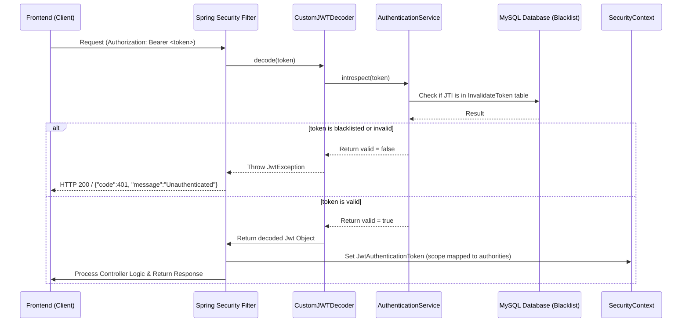

# Spring Boot Backend Analysis for Frontend Architecture

This document provides a comprehensive analysis of the Spring Boot backend codebase for the BikeVN project. It is designed to equip frontend developers with the complete specifications of the APIs, entities, request/response models, and security behaviors needed to build the monorepo frontend (`apps/admin`, `apps/client-web`, `packages/api`, `packages/services`, `packages/types`, `packages/schemas`) without referencing the backend source code.

---

## 1. Authentication Flow

### Auth Endpoints

All authentication endpoints are grouped under the `/auth` base path.

```
POST /auth/login
POST /auth/logout
POST /auth/introspect
```
> [!NOTE]
> There is a `GET /auth/test` endpoint in `AuthenticationController`, but it is protected and requires authentication because `SecurityConfig` only allows anonymous access for `POST` requests to public endpoints.

---

### Request & Response Specifications

#### 1. Login
* **Endpoint**: `POST http://localhost:8080/auth/login`
* **Authentication**: None (Public)
* **Request Body (`AuthenticationRequest`)**:
  ```json
  {
    "email": "user@example.com",
    "password": "yourpassword"
  }
  ```
* **Response Body (`ApiResponse<AuthenticationResponse>`)**:
  ```json
  {
    "code": 1000,
    "result": {
      "token": "eyJhbGciOiJIUzUxMiJ9.ey...",
      "authenticated": true
    }
  }
  ```

#### 2. Logout
* **Endpoint**: `POST http://localhost:8080/auth/logout`
* **Authentication**: None (Public - but token to blacklist must be passed in the body)
* **Request Body (`LogoutRequest`)**:
  ```json
  {
    "token": "eyJhbGciOiJIUzUxMiJ9.ey..."
  }
  ```
* **Response Body (`ApiResponse<Void>`)**:
  ```json
  {
    "code": 1000,
    "message": "Logged out successfully"
  }
  ```

#### 3. Introspect (Verify Token Validity)
* **Endpoint**: `POST http://localhost:8080/auth/introspect`
* **Authentication**: None (Public)
* **Request Body (`IntrospectRequest`)**:
  ```json
  {
    "token": "eyJhbGciOiJIUzUxMiJ9.ey..."
  }
  ```
* **Response Body (`ApiResponse<IntrospectResponse>`)**:
  ```json
  {
    "code": 1000,
    "result": {
      "valid": true
    }
  }
  ```

---

### JWT Strategy

* **Token Types**: Access token only. There is **no Refresh Token** mechanism currently implemented.
* **Algorithm**: HMAC-SHA512 (`HS512`).
* **Expiration**: 10 Days (`Instant.now().plus(10, ChronoUnit.DAYS)`).
* **JWT Claims Structure**:
  * `sub` (Subject): Maps to the user's **name** (`user.getName()`), **not** their email.
  * `iss` (Issuer): `"bike.vn"`.
  * `iat` (Issued At): Timestamp.
  * `exp` (Expiration): Timestamp (10 days in the future).
  * `jti` (JWT ID): A random UUID (`UUID.randomUUID().toString()`).
  * `scope` (Authorities): Space-separated roles prefixed with `ROLE_` (e.g. `"ROLE_user"`, `"ROLE_admin"`).
* **Blacklist Mechanism**: Tokens are blacklisted upon calling `/auth/logout`. The token's JWT ID (`jti`) and expiration time are stored in the database (`InvalidateToken` entity). Every API request triggers `CustomJWTDecoder.decode()`, which calls `AuthenticationService.introspect()`. If the token's `jti` is found in the blacklist database, the token is rejected as invalid.
* **Storage Recommendation**: Since there is no Refresh Token, the token is returned in the HTTP JSON response body. Storing it in `localStorage` is standard for this architecture. Alternatively, a client-accessible Secure Cookie can be used, but standard JS code must handle attaching it as a Bearer token in the `Authorization` header.

---

### Token Validation Flow



---

## 2. Security Config & Endpoints Access

### Security Filter Settings

The backend uses Spring Security (`SecurityFilterChain`) with OAuth2 Resource Server support:
* **CSRF**: Disabled (`httpSecurity.csrf(AbstractHttpConfigurer::disable)`).
* **Session Management**: Defaults to standard configuration (implied stateless for REST API, but not explicitly configured with `SessionCreationPolicy.STATELESS` in `SecurityConfig.java`).
* **CORS**: Not configured globally in `SecurityConfig`. It is configured via `@CrossOrigin` at the controller level (see details in the CORS section).

---

### Endpoints Access Control

Only `POST` requests to designated public endpoints are allowed without authentication. All other HTTP methods and paths require a valid JWT bearer token.

#### 1. Public Endpoints (Only for `POST` requests)
* `POST /auth/login`
* `POST /auth/logout`
* `POST /auth/introspect`
* `POST /user` (User registration)
* `POST /role` (Role creation)
* `POST /permission` (Permission creation)

#### 2. Authenticated Endpoints (Require a valid JWT token)
* `GET /user`
* `GET /user/{userId}`
* `DELETE /user/{userId}`
* `GET /role`
* `DELETE /role/{role}`
* `GET /permission`
* `DELETE /permission/{permission}`

> [!WARNING]
> **Authorization Leak Alert**: Although `@EnableMethodSecurity` is enabled in `SecurityConfig`, there are **no `@PreAuthorize` or `@Secured` annotations** on any of the controller or service methods. This means that **any authenticated user** (even with only the `user` role) can access endpoints like `GET /user` (fetch all users), `DELETE /user/{userId}` (delete a user), `GET /role` (fetch all roles), or `DELETE /role/{role}` (delete roles).

---

## 3. Role & Permission System

### Naming Conventions

* **Roles**: Predefined in `RoleEnum.java` as lowercase strings:
  ```java
  user,
  admin,
  employee
  ```
  In the database, role names are stored as lowercase (e.g. `"user"`, `"admin"`, `"employee"`).
* **Scope Authorities**: The JWT token prefixes the role names with `ROLE_` in the `scope` claim:
  * `"ROLE_user"`
  * `"ROLE_admin"`
  * `"ROLE_employee"`
  
  > [!IMPORTANT]
  > Scope mapping is **case-sensitive** and uses lowercase for the roles: `ROLE_user` / `ROLE_admin` / `ROLE_employee`. Do **not** look for `ROLE_ADMIN` or `ROLE_USER` in uppercase on the frontend.
* **Permissions**: Stored dynamically as strings in the database. There is no predefined enum. Examples of common naming conventions include standard strings, but the backend doesn't restrict them.

---

### Entity Relations

```
User (ManyToMany) -> Role (ManyToMany) -> Permission
```

* A `User` can have multiple `Role`s.
* A `Role` can have multiple `Permission`s.

---

### Data Models & Actual DTO Structures

#### 1. User Response
The `UserResponse` DTO **does not contain roles or permissions** in its payload:
```json
{
  "id": "7f8b9c8d-3a2b-1c0d-9e8f-7a6b5c4d3e2f",
  "name": "Jane Doe",
  "email": "jane@example.com",
  "phone": "0987654321",
  "cccdNumber": "123456789012"
}
```

#### 2. Role Response
```json
{
  "name": "admin",
  "description": "Administrator role",
  "permissions": [
    {
      "name": "USER_DELETE",
      "description": "Permission to delete users"
    }
  ]
}
```

#### 3. Permission Response
```json
{
  "name": "USER_DELETE",
  "description": "Permission to delete users"
}
```

---

## 4. DTO Analysis

Below is the complete dictionary of Request and Response DTOs.

### Request DTOs

#### `AuthenticationRequest`
* `email` (String, required for login)
* `password` (String, required for login)

#### `LogoutRequest`
* `token` (String, JWT token to blacklist)

#### `IntrospectRequest`
* `token` (String, JWT token to validate)

#### `UserCreationRequest`
* `name` (String, validation: `@NotBlank(message = "USER_INVALID")`)
* `email` (String)
* `passwordHash` (String, validation: `@Size(min = 6, message = "PASSWORD_INVALID")`)
* `phone` (String)
* `cccdNumber` (String)

> [!WARNING]
> **DTO Property Anomaly**: The property name for the user's password during user creation is `passwordHash`, **not** `password`. However, in the `AuthenticationRequest` (login), the property name is `password`.

#### `RoleRequest`
* `name` (String, unique identifier for the role)
* `description` (String)
* `permissions` (Set of Strings containing names of permissions to assign)

#### `PermissionRequest`
* `name` (String, unique identifier for the permission)
* `description` (String)

---

### Response DTOs

#### `ApiResponse<T>`
Wrap standard for all endpoint responses:
* `code` (int, default = `1000`)
* `message` (String, optional, set only if needed)
* `result` (Generic type `T`, contains payload)

#### `AuthenticationResponse`
* `token` (String, JWT token string)
* `authenticated` (boolean)

#### `IntrospectResponse`
* `valid` (Boolean)

#### `UserResponse`
* `id` (String UUID)
* `name` (String)
* `email` (String)
* `phone` (String)
* `cccdNumber` (String)

#### `RoleResponse`
* `name` (String)
* `description` (String)
* `permissions` (Set of `PermissionResponse`)

#### `PermissionResponse`
* `name` (String)
* `description` (String)

---

## 5. ApiResponse Standard

All responses from controllers use the wrapper class `ApiResponse<T>`:
```json
{
  "code": 1000,
  "message": "Success message or description",
  "result": {}
}
```

* **Successful Response**: Code is always `1000` (by default). The payload is in the `result` field.
* **Error/Special State Responses**: The code is non-1000, and `result` might be null.

---

## 6. Error Handling

### Handler Behavior

> [!IMPORTANT]
> **No Global Error Handling**: The backend does **not** contain a `@ControllerAdvice` or `@RestControllerAdvice` class. Except for OAuth2 exceptions, standard exceptions like `RuntimeException` thrown from service classes are not captured and mapped. They bubble up as standard Spring Boot 500 server errors.

---

### Error Structures

#### 1. Authentication Failure (Invalid or Expired JWT)
Handled by `JwtAuthenticationEntryPoint`. 
* **HTTP Status Code**: `200 OK` (Note: `response.setStatus(401)` is commented out in `JwtAuthenticationEntryPoint.java`).
* **Response Body**:
  ```json
  {
    "code": 401,
    "message": "Unauthenticated"
  }
  ```
  > [!CAUTION]
  > Since the HTTP status is `200 OK` but the logical code inside the body is `401`, standard axios HTTP error interceptors (which trigger on status >= 300) will **not** trigger naturally. The interceptor must look inside the JSON body data and inspect if `code === 401`.

#### 2. Access Denied (Unauthorized Access)
Handled by `JwtAccessDeniedHandler`.
* **HTTP Status Code**: `403 Forbidden` (explicitly set).
* **Response Body**:
  ```json
  {
    "code": 403,
    "message": "You don't have permission"
  }
  ```

#### 3. Standard Business Logic Errors (e.g. User Exists, Incorrect Password)
Thrown as `RuntimeException` inside the service layers.
* **HTTP Status Code**: `500 Internal Server Error`
* **Response Body** (Standard Spring Boot default error fallback):
  ```json
  {
    "timestamp": "2026-05-20T15:00:00.000+00:00",
    "status": 500,
    "error": "Internal Server Error",
    "message": "user existed",
    "path": "/user"
  }
  ```
  *Common message values:*
  * `"user existed"`
  * `"user is not exist"`
  * `"User not exist"`
  * `"Password is required"`
  * `"Incorrect Password"`
  * `"Can't signed token"`

#### 4. Fields Validation Failure (e.g. blank name, password length < 6)
Spring Boot returns a standard 400 Bad Request error structure containing field validation details. Note that validation messages like `"USER_INVALID"` and `"PASSWORD_INVALID"` are returned inside the default validation response.

---

## 7. User APIs Spec

All paths are prefixed with `/user`.

### 1. Create/Register User
* **Method**: `POST`
* **Path**: `/user`
* **Auth**: None (Permitted via `SecurityConfig`)
* **Request Body**: `UserCreationRequest`
* **Response Body**: `ApiResponse<UserResponse>`

### 2. Get All Users
* **Method**: `GET`
* **Path**: `/user`
* **Auth**: Required (Bearer Token)
* **Request Body**: None
* **Response Body**: `ApiResponse<List<UserResponse>>`

### 3. Get User By ID
* **Method**: `GET`
* **Path**: `/user/{userId}`
* **Auth**: Required (Bearer Token)
* **Request Body**: None
* **Response Body**: `ApiResponse<UserResponse>`

### 4. Delete User By ID
* **Method**: `DELETE`
* **Path**: `/user/{userId}`
* **Auth**: Required (Bearer Token)
* **Request Body**: None
* **Response Body**: `ApiResponse<Void>` (Result is null, message is `"User Deleted"`)

---

## 8. CORS Configuration

* **Allowed Origins**: `http://localhost:5173` (Vite's default port).
* **Configured Endpoints**:
  * `/auth/**` (via `@CrossOrigin` in `AuthenticationController`)
  * `/user/**` (via `@CrossOrigin` in `UserController`)
* **Missing CORS Endpoints**:
  * `/role/**` (`RoleController` has no `@CrossOrigin` annotation)
  * `/permission/**` (`PermissionController` has no `@CrossOrigin` annotation)

> [!WARNING]
> **CORS Blockage Warning**: If the client application makes direct API calls to `/role` or `/permission` from `http://localhost:5173`, the browser will block them due to CORS. Frontend developers must configure a proxy (like Vite's dev server proxy) to map `/role` and `/permission` requests, or update the backend controllers.

---

## 9. Database Entities

### 1. `User` (Table: `users`)
* `id` (`VARCHAR(36)`): Primary Key (UUID generation strategy).
* `name` (`VARCHAR(255)`): Nullable.
* `email` (`VARCHAR(255)`): Nullable.
* `passwordHash` (Column: `password_hash`, `VARCHAR(255)`): Nullable.
* `phone` (`VARCHAR(255)`): Nullable.
* `cccdNumber` (Column: `cccd_number`, `VARCHAR(255)`): Nullable.
* **Relations**: Many-To-Many relationship with `Role` mapped via `users_roles` table (foreign keys `user_id` and `role_id`). Loaded EAGERLY.

### 2. `Role` (Table: `role`)
* `id` (`VARCHAR(36)`): Primary Key (UUID generation strategy).
* `name` (`VARCHAR(255)`): Unique, non-nullable.
* `description` (`VARCHAR(255)`): Nullable.
* **Relations**: Many-To-Many relationship with `Permission` mapped via `role_permissions` table (foreign keys `role_id` and `permission_id`). Loaded EAGERLY.

### 3. `Permission` (Table: `permission`)
* `id` (`VARCHAR(36)`): Primary Key (UUID generation strategy).
* `name` (`VARCHAR(255)`): Unique, non-nullable.
* `description` (`VARCHAR(255)`): Nullable.

### 4. `InvalidateToken` (Table: `invalidate_token`)
* `id` (`VARCHAR(255)`): Primary Key. Stores the JWT's `jti` claim.
* `expiryTime` (`DATETIME`): Expiration time of the blacklisted token.

---

## 10. Critical Backend Bugs & Quirks to Handle on Frontend

1. **Role/Permission Deletion Bug**:
   In `RoleService` and `PermissionService`, the delete methods call `roleRepository.deleteById(role)` and `permissionRepository.deleteById(permission)`. However, the role and permission names are passed as the parameter, whereas the database Primary Key (`@Id`) is a generated UUID. Passing name values (like `admin` or `USER_CREATE`) to these delete endpoints will fail to delete anything.
2. **User Creation Role Assignment Bug**:
   In `UserService.createUser()`, it attempts to check if the default role exists using `roleRepository.findById(RoleEnum.user.name())` (looking for ID `"user"`). However, the Role entity generates a UUID for the `id` field when saving, leaving the `name` column as `"user"`. Since the primary key `id` is a UUID, subsequent registrations will look for ID `"user"`, fail to find it, and attempt to save a new Role entity with `name="user"`, causing a database duplicate entry constraint violation.
3. **HTTP 200 on 401 Unauthenticated**:
   The `JwtAuthenticationEntryPoint` does not set the response HTTP status to 401. All invalid/missing/expired JWT calls return HTTP Status `200 OK` with JSON `{ "code": 401, "message": "Unauthenticated" }`.

---

## 11. Frontend Implementation Recommendations

### Monorepo Shared Packages

We recommend organizing the shared codebase under `packages/` as follows:

```
packages/
 ├── types/       # Global types & DTO interfaces
 ├── schemas/     # Zod schemas for user/auth validations
 ├── api/         # Axios instance, api config, and endpoints declarations
 └── services/    # Token storage, auth verification logic, client-side guards
```

#### 1. `packages/types`
Define TS interfaces for all DTOs:
```typescript
export interface ApiResponse<T> {
  code: number;
  message?: string;
  result?: T;
}

export interface UserResponse {
  id: string;
  name: string;
  email: string;
  phone: string;
  cccdNumber: string;
}

export interface AuthenticationResponse {
  token: string;
  authenticated: boolean;
}

export interface IntrospectResponse {
  valid: boolean;
}
```

#### 2. `packages/schemas`
Define Zod validation schemas matching Spring validation rules:
```typescript
import { z } from 'zod';

export const UserCreationSchema = z.object({
  name: z.string().min(1, 'USER_INVALID'),
  email: z.string().email().optional(),
  passwordHash: z.string().min(6, 'PASSWORD_INVALID'), // MUST match backend passwordHash property
  phone: z.string().optional(),
  cccdNumber: z.string().optional(),
});
```

---

### Axios & Token Interceptor Architecture

Due to the HTTP 200 code 401 anomaly, the Axios interceptor must be custom-tailored:

```typescript
import axios from 'axios';

const api = axios.create({
  baseURL: 'http://localhost:8080',
});

// Request Interceptor: Attach token
api.interceptors.request.use((config) => {
  const token = localStorage.getItem('auth_token');
  if (token) {
    config.headers.Authorization = `Bearer ${token}`;
  }
  return config;
});

// Response Interceptor: Parse wrapper & intercept logical errors
api.interceptors.response.use(
  (response) => {
    const data = response.data;
    
    // Anomaly: 401 Unauthenticated returns HTTP 200 with code = 401
    if (data && data.code === 401) {
      localStorage.removeItem('auth_token');
      window.location.href = '/login';
      return Promise.reject(new Error('Unauthenticated'));
    }

    // Handle standard business success
    if (data && data.code === 1000) {
      return data; // returns ApiResponse wrapper, or data.result to flatten
    }

    return response;
  },
  (error) => {
    // Handle true HTTP Status errors (like HTTP 403 Access Denied)
    if (error.response && error.response.status === 403) {
      // Handle Forbidden access
      console.error('Permission denied');
    }
    return Promise.reject(error);
  }
);
```

---

### Role-Based Access Guards & Auth Flow

1. **Token Decoding**:
   Since the `UserResponse` does not contain roles, the frontend must parse the JWT token itself to determine the logged-in user's roles and name.
   Use `jwt-decode` (or basic base64 decoding of the middle segment) to extract:
   * **Roles**: From the `scope` claim, splitting by space:
     ```typescript
     const getRolesFromToken = (token: string): string[] => {
       try {
         const decoded = jwtDecode<{ scope: string }>(token);
         return decoded.scope ? decoded.scope.split(' ') : [];
       } catch {
         return [];
       }
     };
     ```
   * **User Name**: From the `sub` (subject) claim.

2. **Client Route Guard (Client App)**:
   * Accessible by users with `ROLE_user` authority in the JWT token.
   * Redirect to `/login` if no token is found or `/auth/introspect` fails.

3. **Admin Route Guard (Admin App)**:
   * Route protection must verify that the token's scope array includes `"ROLE_admin"` or `"ROLE_employee"`.
   * Block access or redirect with a warning if the required role is missing.
